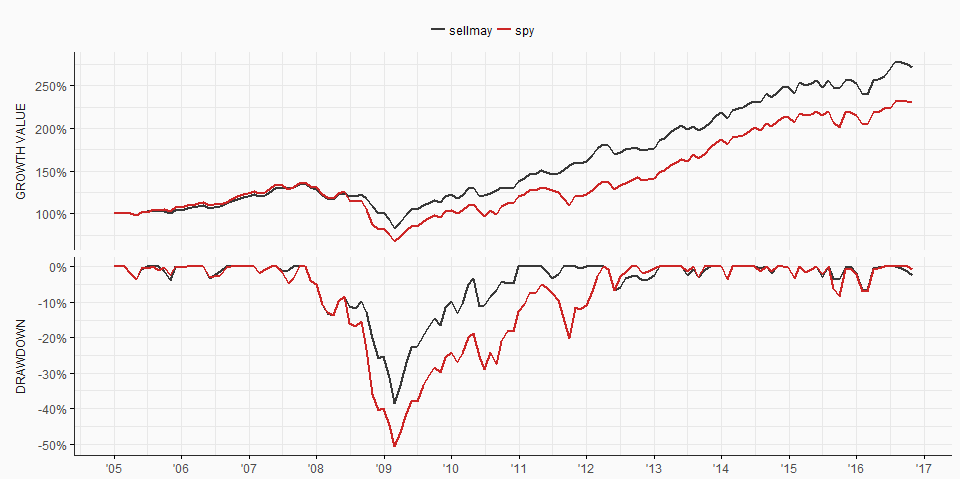

aaR - Intro
================
11-Jul-2017

-   [Simple Allocation](#simple-allocation)
-   [Calendar Rebalancing](#calendar-rebalancing)
-   [Sell May](#sell-may)
-   [All Calendar Periods](#all-calendar-periods)
-   [Bands on Securities](#bands-on-securities)
-   [Bands on Asset Classes](#bands-on-asset-classes)

Examples of rebalancing methods in order to build model portfolios based on `aaR` package.

------------------------------------------------------------------------

Simple Allocation
-----------------

Allocate at the beginning and no further rebalancing thereafter.

``` r
res <- portfolio_returns(prices = data, method = "none", name = "01 - simple portfolio", verbose = TRUE)
res
```


    +-------------------------------------+
    +     Asset Allocation Portfolio      +
    +-------------------------------------+


    Portfolio : 01 - simple portfolio 
    Method    : none rebalancing 

    +-------------------------------------+

           statistic         value
    1         Period Jan-05/Oct-16
    2           Cagr        6.27 %
    3      An.Return        6.35 %
    4  An.Volatility        8.34 %
    5       Rew.Risk          0.76
    6          MaxDD      -36.06 %
    7        MaxDDur          4.19
    8          Omega          2.64
    9    Track.Error        0.00 %
    10    Active.Ret        0.00 %
    11    Info.Ratio           NaN
    12      Turnover        0.00 %

    +-------------------------------------+

Calendar Rebalancing
--------------------

Rebalance the portfolio every quarter. On this example rebalancing takes place on Feb, May, Aug, Nov.

``` r
res <- portfolio_returns(prices = data, method = "calendar",
                         period = "quarters2", weights = c(0.3,0.3,0.4), 
                         slippage = 0.15/100, name = "02 - simple portfolio", verbose = TRUE)
res
```


    +-------------------------------------+
    +     Asset Allocation Portfolio      +
    +-------------------------------------+


    Portfolio : 02 - simple portfolio 
    Method    : calendar rebalancing 
    Period    : quarters2 

    Weights:

        SPY    TLT    EFA
     30.00% 30.00% 40.00%

    Slippage:

       SPY   TLT   EFA
     0.15% 0.15% 0.15%

    +-------------------------------------+

           statistic         value
    1         Period Jan-05/Oct-16
    2           Cagr        6.74 %
    3      An.Return        6.91 %
    4  An.Volatility        9.82 %
    5       Rew.Risk           0.7
    6          MaxDD      -40.15 %
    7        MaxDDur          3.32
    8          Omega          2.48
    9    Track.Error        0.00 %
    10    Active.Ret        0.00 %
    11    Info.Ratio           NaN
    12      Turnover        0.20 %

    +-------------------------------------+

Sell May
--------

Rebalance the portfolio by reducing the equity exposure at the end of May and reverting back to normal weights at the end of Oct.

``` r
data01 <- data[,c("SPY","TLT")]

wts <- alternate_weights(prices = data01, 
                         weights = matrix(c(0.5, 0.5, 1, 0), nrow = 2, byrow = TRUE),
                         months = c("May", "Oct"))

head(wts)
```

               SPY TLT
    2005-01-03 1.0 0.0
    2005-05-31 0.5 0.5
    2005-10-31 1.0 0.0
    2006-05-31 0.5 0.5
    2006-10-31 1.0 0.0
    2007-05-31 0.5 0.5

``` r
res <- portfolio_returns(prices = data01, weights = wts,  method = "irregular",
                         slippage = 0.15/100, name = "03 - sell may portfolio", verbose = TRUE)

summary(obj = res, bkm = data01[,1], .name = "Sell May")
```

    # A tibble: 12 x 2
           statistic    `Sell May`
               <chr>         <chr>
     1        Period Jan-05/Oct-16
     2          Cagr        8.71 %
     3     An.Return        8.91 %
     4 An.Volatility       11.41 %
     5      Rew.Risk          0.78
     6         MaxDD      -43.81 %
     7       MaxDDur          3.13
     8         Omega          2.84
     9   Track.Error        8.78 %
    10    Active.Ret        1.48 %
    11    Info.Ratio          0.17
    12      Turnover        2.06 %



All Calendar Periods
--------------------

Rebalance the portfolio by all calendar periods and compare.

``` r
pd <-c("weeks", "months", "quarters", "quarters2", "semi-annual", "years")

res <- purrr::map(pd, ~portfolio_returns(prices = data, method = "calendar",
                         period = .x, weights = c(0.3,0.3,0.4), 
                         slippage = 0.15/100, name = .x, verbose = TRUE)) %>% 
                         setNames(.,pd)
```

| statistic     | weeks         | months        | quarters      | quarters2     | semi-annual   | years         |
|:--------------|:--------------|:--------------|:--------------|:--------------|:--------------|:--------------|
| Period        | Jan-05/Oct-16 | Jan-05/Oct-16 | Jan-05/Oct-16 | Jan-05/Oct-16 | Jan-05/Oct-16 | Jan-05/Oct-16 |
| Cagr          | 6.69 %        | 6.52 %        | 6.86 %        | 6.74 %        | 7.03 %        | 7.15 %        |
| An.Return     | 6.88 %        | 6.72 %        | 7.02 %        | 6.91 %        | 7.16 %        | 7.27 %        |
| An.Volatility | 9.86 %        | 9.95 %        | 9.75 %        | 9.82 %        | 9.61 %        | 9.55 %        |
| Rew.Risk      | 0.7           | 0.68          | 0.72          | 0.7           | 0.74          | 0.76          |
| MaxDD         | -40.96 %      | -41.47 %      | -40.43 %      | -40.15 %      | -39.17 %      | -38.08 %      |
| MaxDDur       | 3.48          | 3.5           | 3.47          | 3.32          | 3.25          | 3.01          |
| Omega         | 2.44          | 2.39          | 2.54          | 2.48          | 2.61          | 2.68          |
| Track.Error   | 0.00 %        | 0.00 %        | 0.00 %        | 0.00 %        | 0.00 %        | 0.00 %        |
| Active.Ret    | 0.00 %        | 0.00 %        | 0.00 %        | 0.00 %        | 0.00 %        | 0.00 %        |
| Info.Ratio    | NaN           | NaN           | NaN           | NaN           | NaN           | NaN           |
| Turnover      | 0.76 %        | 0.33 %        | 0.21 %        | 0.20 %        | 0.17 %        | 0.11 %        |

Bands on Securities
-------------------

Rebalance the portfolio using band limits.

``` r
res <- portfolio_returns(prices = data, method = "bands",
                         weights = c(0.3,0.3,0.4), 
                         bands = c(2.5/100, 3/100, 2/100),
                         slippage = 0.15/100, name = "05 - bands portfolio", verbose = TRUE)
res
```


    +-------------------------------------+
    +     Asset Allocation Portfolio      +
    +-------------------------------------+


    Portfolio : 05 - bands portfolio 
    Method    : bands rebalancing 

    Bands:

       SPY   TLT   EFA
     2.50% 3.00% 2.00%

    Weights:

        SPY    TLT    EFA
     30.00% 30.00% 40.00%

    Slippage:

       SPY   TLT   EFA
     0.15% 0.15% 0.15%

    +-------------------------------------+

           statistic         value
    1         Period Jan-05/Oct-16
    2           Cagr        6.65 %
    3      An.Return        6.84 %
    4  An.Volatility        9.84 %
    5       Rew.Risk          0.69
    6          MaxDD      -40.78 %
    7        MaxDDur          3.48
    8          Omega          2.44
    9    Track.Error        0.00 %
    10    Active.Ret        0.00 %
    11    Info.Ratio           NaN
    12      Turnover        0.23 %

    +-------------------------------------+

Bands on Asset Classes
----------------------

``` r
weights = c(10, 10, 30, 20, 30)/100
groups <- list(EQ = c("EEM", "EFA"),
               FI = c("SHY", "TLT"),
               ALT = "GLD")

res <- portfolio_returns(prices = data2, method = "bands",
                         weights = weights, 
                         bands = 3/100, groups = groups,
                         slippage = 0.15/100, name = "05 - asset class bands", 
                         verbose = TRUE)
res
```


    +-------------------------------------+
    +     Asset Allocation Portfolio      +
    +-------------------------------------+


    Portfolio : 05 - asset class bands 
    Method    : bands rebalancing 

    Bands:

        EQ    FI   ALT
     3.00% 3.00% 3.00%

    Group Weights:

         EQ     FI    ALT
     50.00% 40.00% 10.00%

    Weights:

        GLD    TLT    EEM    EFA    SHY
     10.00% 10.00% 30.00% 20.00% 30.00%

    Slippage:

       GLD   TLT   EEM   EFA   SHY
     0.15% 0.15% 0.15% 0.15% 0.15%

    +-------------------------------------+

           statistic         value
    1         Period Jan-12/Oct-16
    2           Cagr        2.20 %
    3      An.Return        2.29 %
    4  An.Volatility        6.79 %
    5       Rew.Risk          0.34
    6          MaxDD      -15.92 %
    7        MaxDDur          1.44
    8          Omega          1.51
    9    Track.Error        0.00 %
    10    Active.Ret        0.00 %
    11    Info.Ratio           NaN
    12      Turnover        0.07 %

    +-------------------------------------+
