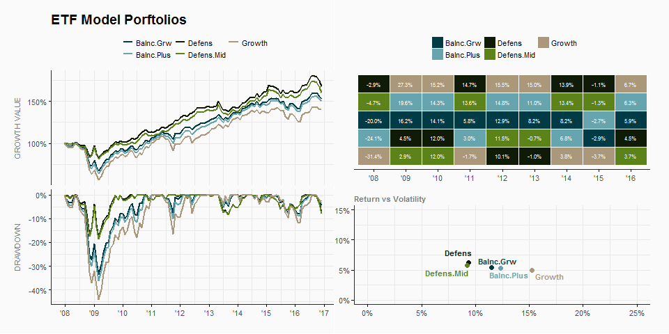

ETF Model Porfolios
================
04-Nov-2017

-   [The Model Portfolios](#the-model-portfolios)
-   [The ETF Universe](#the-etf-universe)
-   [Run Portfolios](#run-portfolios)
-   [Summary](#summary)

### The Model Portfolios

| Model      | Equity | Fixed Income | Alternatives |
|:-----------|:------:|:------------:|:------------:|
| Growth     |   70   |      20      |      10      |
| Balnc.Grw  |   50   |      40      |      10      |
| Balnc.Plus |   55   |      37      |       8      |
| Defens     |   22   |      72      |       6      |
| Defens.Mid |   20   |      70      |      10      |

### The ETF Universe

| Asset Class  | Asset Sub Class   | Ticker | Growth | Balnc.Grw | Balnc.Plus | Defens | Defens.Mid |
|:-------------|:------------------|:-------|:------:|:---------:|:----------:|:------:|:----------:|
| Equity       | US Large Cap      | SPY    |   20   |     19    |     22     |   10   |     10     |
| Equity       | US Mid Cap        | IJH    |   10   |     8     |      8     |    0   |      0     |
| Equity       | US Small Cap      | IWM    |    5   |     0     |      2     |    0   |      0     |
| Equity       | Int'l DM          | EFA    |   25   |     17    |     17     |   10   |     10     |
| Equity       | Emerging Mkts     | EEM    |   10   |     6     |      6     |    2   |      0     |
| Fixed Income | Long Term UST     | TLT    |    5   |     20    |     15     |   36   |     40     |
| Fixed Income | TIPS              | TIP    |    0   |     0     |      0     |    5   |      5     |
| Fixed Income | Investement Grade | LQD    |   10   |     15    |     12     |   17   |     17     |
| Fixed Income | High Yield        | HYG    |    5   |     5     |      8     |    8   |      8     |
| Fixed Income | Emerging Mkts     | EMB    |    0   |     0     |      2     |    6   |      0     |
| Alternatives | Overall Cmd       | DBC    |    5   |     5     |      3     |    0   |      0     |
| Alternatives | US REIT           | VNQ    |    5   |     5     |      0     |    6   |      0     |
| Alternatives | Int REIT          | RWX    |    0   |     0     |      5     |    0   |     10     |

### Run Portfolios

``` r
# Run backtest
res   <- pmap(params, portfolio_returns, method = "calendar", period = "months") %>% 
         setNames(nm)

# Extract and plot combo
map(res,"main") %>% 
melt_xts_all(.) %>% 
gg_combo(p_title = "ETF Model Porftolios", ncol = 3, col_palette = pal)
```



### Summary

| statistic     |     Growth    |   Balnc.Grw   |   Balnc.Plus  |     Defens    |   Defens.Mid  |
|:--------------|:-------------:|:-------------:|:-------------:|:-------------:|:-------------:|
| Period        | Dec-07/Nov-16 | Dec-07/Nov-16 | Dec-07/Nov-16 | Dec-07/Nov-16 | Dec-07/Nov-16 |
| Cagr          |     3.94 %    |     4.95 %    |     4.77 %    |     6.01 %    |     5.53 %    |
| An.Return     |     4.92 %    |     5.26 %    |     5.21 %    |     6.01 %    |     5.57 %    |
| An.Volatility |    15.50 %    |    10.87 %    |    11.99 %    |     8.30 %    |     8.49 %    |
| Rew.Risk      |      0.32     |      0.48     |      0.44     |      0.72     |      0.66     |
| MaxDD         |    -48.61 %   |    -37.86 %   |    -40.83 %   |    -20.84 %   |    -21.81 %   |
| MaxDDur       |      2.71     |      2.37     |      2.41     |      1.33     |      1.87     |
| Omega         |      1.52     |      1.85     |      1.74     |      2.56     |      2.32     |
| Track.Error   |     0.00 %    |     0.00 %    |     0.00 %    |     0.00 %    |     0.00 %    |
| Active.Ret    |     0.00 %    |     0.00 %    |     0.00 %    |     0.00 %    |     0.00 %    |
| Info.Ratio    |      NaN      |      NaN      |      NaN      |      NaN      |      NaN      |
