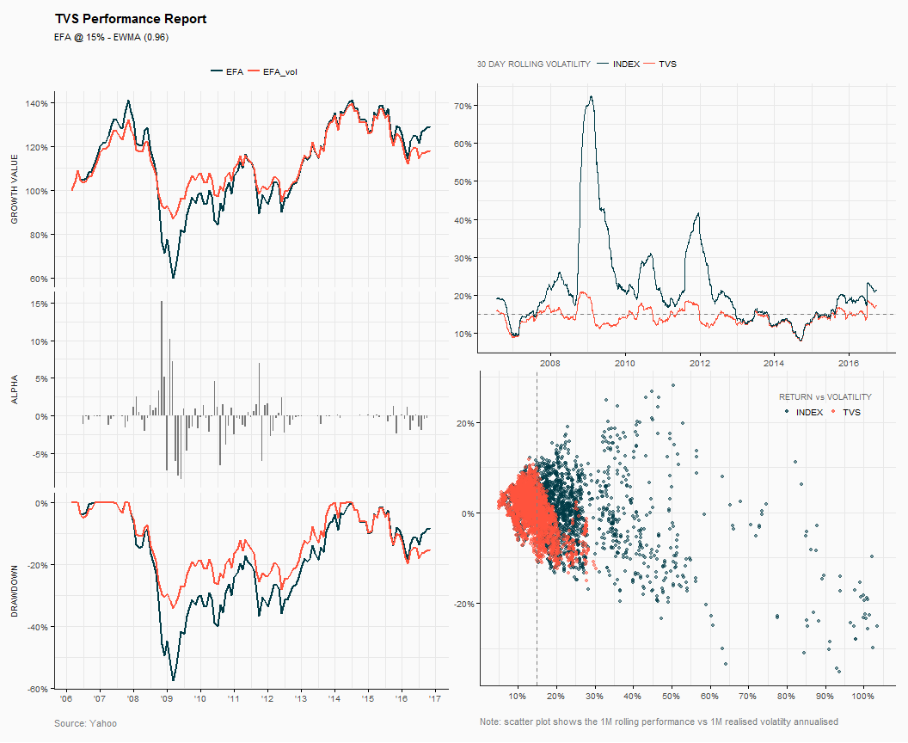

Target Volatility Strategy
================
19-Mar-2017

-   [Introduction](#introduction)
-   [Run tvs model](#run-tvs-model)
-   [Analytics](#analytics)

Introduction
------------

The `tvs()` is intented to create a risk targeted exposure. In order to achieve the desired target volatilty level, the `tvs()` will allocate between a risky security and a cash based on the base index's forecasted and realised volatilty.

On this example:

-   ETF: iShares MSCI EAFE (EFA)
-   Target Vol: 15%
-   Re-allocation buffer 5%
-   Forecast method: `ewma` with 290 days window
-   No leverage

Run tvs model
-------------

``` r
res <- tvs(prices = data[,"EFA"], target = 15/100, leverage = 1, buffer = 5/100,
        n = 290, lambda = 0.96, period = "daily", center = FALSE,  
        type_ret = "continuous", slippage = 0.15/100, name = "EFA TVS @ 15%")

res
```


    +--------------------------------------------+
    +        Target Volatility Strategy          + 
    +--------------------------------------------+


    Portfolio  : EFA TVS @ 15% 
    Asset      : EFA 
    Target Vol : 15.0% 
    Leverage   : NO 
    Buffer     : 5.0% 
    Method     : EWMA (0.96) 
    Window     : 290 days 
    Slippage   : 0.15% 

    +--------------------------------------------+

           statistic           tvs    base_index
    1         Period Feb-06/Oct-16 Feb-06/Oct-16
    2           Cagr        1.54 %        2.39 %
    3      An.Return        2.16 %        4.12 %
    4  An.Volatility       11.76 %       19.17 %
    5       Rew.Risk          0.18          0.21
    6          MaxDD      -35.82 %      -61.04 %
    7        MaxDDur          5.97          6.59
    8          Omega          1.26          1.34
    9    Track.Error        9.46 %        0.00 %
    10    Active.Ret       -0.82 %        0.00 %
    11    Info.Ratio         -0.09           NaN
    12   N# Triggers           210             0

    +--------------------------------------------+

Analytics
---------

`analytics()` returns a number of diagnositic graphs to evaluate the target volatility strategy.

``` r
an.vis <- analytics(x = res)
```



------------------------------------------------------------------------

**Rebalancing Trades**


**EFA TVS Exposure**


