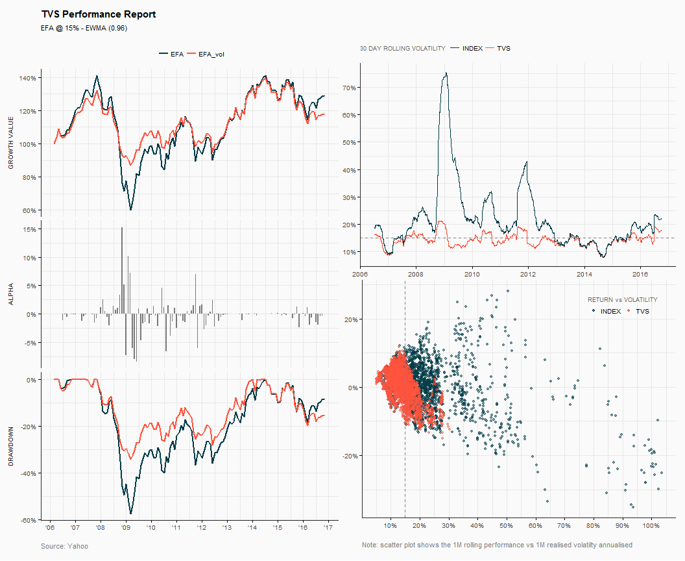

Target Volatility Strategy
================
04-Nov-2017

-   [Introduction](#introduction)
-   [Run tvs model](#run-tvs-model)
-   [Analytics](#analytics)

Introduction
------------

The `tvs()` creates a risk targeted exposure in order to achieve a desired target volatility level; the `tvs()` function will allocate between a risky asset and a cash, based on the asset's forecasted and realised volatility.

On this example:

-   ETF: iShares MSCI EAFE (EFA)
-   Target Vol: 15%
-   Re-allocation buffer 5%
-   Forecasting method: `ewma` with 290 days window
-   No leverage

Run tvs model
-------------

``` r
res <- tvs(prices = data[,"EFA"], target = 15/100, leverage = 1, buffer = 5/100,
        n = 290, lambda = 0.96, period = "daily", center = FALSE,  
        type_ret = "continuous", slippage = 0.15/100, name = "EFA TVS @ 15%")

print(res, col = FALSE)
```

    ________________________ * Target Volatility Strategy * ________________________


    Portfolio  : EFA TVS @ 15% 
    Asset      : EFA 
    Target Vol : 15.0% 
    Leverage   : NO 
    Buffer     : 5.0% 
    Method     : EWMA (0.96) 
    Window     : 290 days 


    Profile - -- -- -- -- -- -- -- -- -- -- -- -- -- -- -- -- -- -- -- -- -- -- -- -

    Slippage   : 

     Assets    TC
        EFA 0.15%
       cash 0.15%


    Performance Summary - -- -- -- -- -- -- -- -- -- -- -- -- -- -- -- -- -- -- -- -

         statistic           tvs    base_index
            Period Feb-06/Oct-16 Feb-06/Oct-16
              Cagr        1.54 %        2.39 %
         An.Return        2.16 %        4.12 %
     An.Volatility       11.76 %       19.17 %
          Rew.Risk          0.18          0.21
             MaxDD      -35.82 %      -61.04 %
           MaxDDur          5.97          6.59
             Omega          1.26          1.34
       Track.Error        9.46 %        0.00 %
        Active.Ret       -0.82 %        0.00 %
        Info.Ratio         -0.09           NaN
          Triggers           210             0
          Turnover        3.87 %             0
    ________________________________________________________________________________

Analytics
---------

`analytics()` returns a number of diagnostic graphs for evaluating the target volatility strategy.

``` r
an.vis <- analytics(x = res)
```



------------------------------------------------------------------------

**Rebalancing Trades**


**EFA TVS Exposure**


